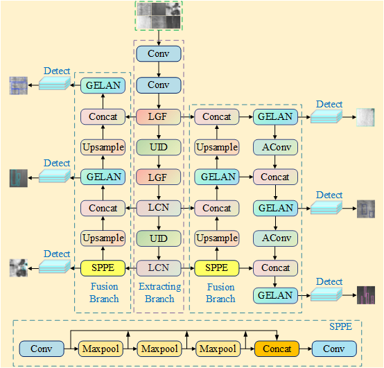
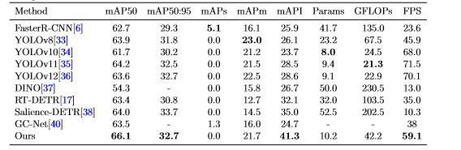

# MFDFNet
Note: We will soon release the MFDENet code as open source.Currently, we provide the model architecture diagram along with its visualized schematic.
MFDFNet centers on feature extraction via a backbone network and adopts a dual-branch fusion strategy. The network architecture is illustrated below:

The GC10-DET comparative experimental results are as follows.

