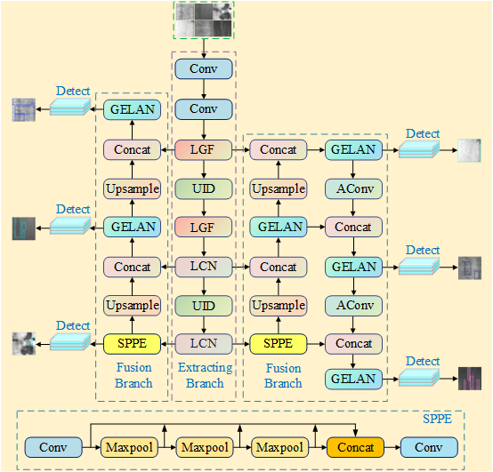
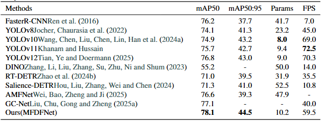

# MFDFNet
## Notice  
We will release the complete code in the near future; Currently,we provide main code of MFDFNet
## Overall structure
 MFDFNet is a steel surface defect detection network that centers on multi-scale feature extraction and employs a dual branch fusion strategy.Its architecture is depicted in the figure below.The feature extraction module forms the core of MFDFNet and contains three submodules, designated LGF, UID, and LCN.

## GC10-DET comparative results

